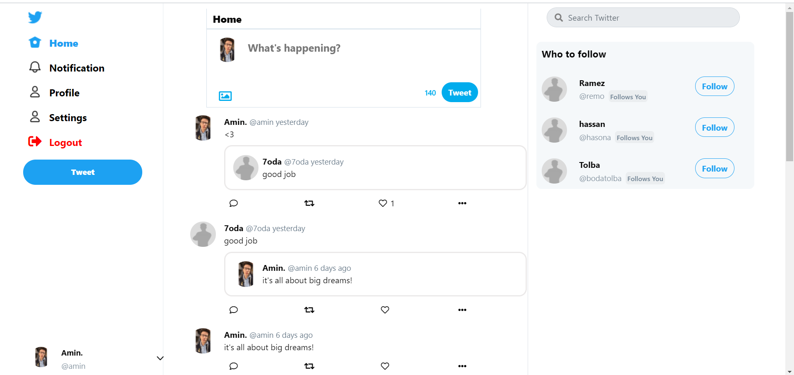
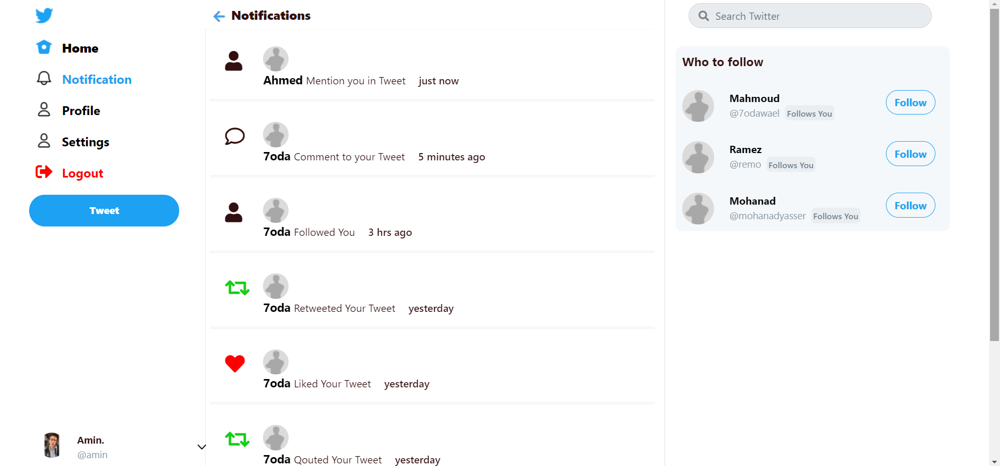
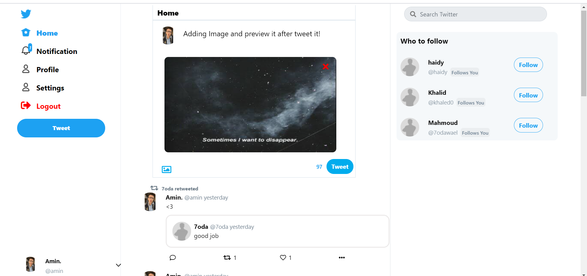

Bulit PHP **Campus|Connect** IN OOP style and using MYSQL Database. AJAX and Jquery for requests without reloading like Follow/unfollow, like, Search users, Show popups like comment , User lists, etc.


## Features

- Sign in 
- Post Image or Normal Post.
- RePost or Qoute post (You can qoute the qouted post).
- Like post.
- Add Comment and reply to the comment (Nested Comments).
- Mention User in post or add hashtag to your post.
- Follow/Unfollow user.
- Get Notification when any previous action happened.
- Change Username/Password/Email From Settings.
- Search users by name and username.
- Edit Profile Like: (Change :avatar/username/cover etc).

## Running locally
 
 - Create New Database then import twitter.sql file on it.
 - go to PATH **core/classes/connection.php** and add your database info.

 ```php
    protected static $servername = "localhost";
    protected static $db_name="twitter";
    protected static $username = "root";
    protected static $password = "";
```
 then the project is ready to run in localhost!

## 📷 UI


### Index


### Home


### post and Comments


### Profile


### Notifications


### Edit Account


### Preview Image before post


### Users List (For following/likedby etc)


### Setting
 


